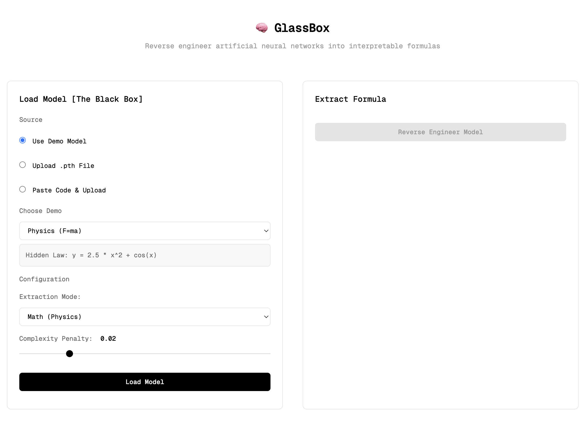

# Project GlassBox

**Neuro-Symbolic Translation for Deep Learning Interpretability**


GlassBox is a research tool designed to reverse-engineer "Black Box" Artificial Neural Networks into "White Box" algorithms. It takes a trained PyTorch model as input and extracts a human-readable representation, either a mathematical equation (via Symbolic Regression) or a set of logical rules (via Decision Tree Distillation).

This project aims to solve the interpretability crisis in high-stakes AI (finance, physics, healthcare) by proving that complex neural networks often approximate simple, discoverable laws.

## Features

*   **Math Mode:** Extracts closed-form equations (e.g., y = 0.5 * x^2) using Genetic Programming. Best for physics and regression tasks.
*   **Logic Mode:** Extracts branching IF/ELSE rules using sparse decision trees. Best for classification and business logic.
*   **Active Interrogation:** Generates synthetic probe data to analyze models even without access to the original training dataset.
*   **Model Loading:** Supports loading external PyTorch state dictionaries (.pth files) with custom architecture definitions.
*   **Web Interface:** A FastAPI + HTML frontend for easy interaction and visualization.



## Installation

1. Clone the repository and navigate to the folder.

2. Create a virtual environment (recommended):
   ```bash
   python -m venv venv
   source venv/bin/activate  # On Windows use: venv\Scripts\activate
   ```

3. Install the required packages:
   ```bash
   pip install -r requirements.txt
   ```
   *(Or manually: `pip install torch numpy pandas matplotlib pysr scikit-learn fastapi uvicorn python-multipart`)*

   *Note: PySR requires Julia. The Python package will attempt to install Julia automatically on the first run.*

   For common installation issues, please refer to [TROUBLESHOOTING.md](TROUBLESHOOTING.md).

## Usage

1. Start the web server:
   ```bash
   uvicorn server:app --reload
   ```
   *(Note: The main entry point is `server.py`)*

2. Open your web browser and navigate to:
   http://127.0.0.1:8000

3. You can:
   *   Run the built-in Physics or Logic demos.
   *   Upload a .pth file along with the Python class definition used to create it.

## How It Works

GlassBox uses a "Teacher-Student" knowledge distillation approach:

1.  **The Teacher:** The user provides a trained Neural Network (the Black Box).
2.  **The Interrogator:** GlassBox generates random input data (Gaussian noise) to query the Teacher and map its decision surface.
3.  **The Student:** I trained an interpretable model (Symbolic Regressor or Decision Tree) to mimic the Teacher's outputs.
4.  **Refinement:** The resulting equation or tree is pruned for complexity to ensure readability.

## Example Result & "The Bad News"

While GlassBox can find hidden laws, it sometimes suffers from "Bloat".

*   **The Truth:** $2.5x^2 + \cos(x)$
*   **GlassBox found:** `((x0 + x0)*0.79... - .../sin(x0))**2 + ...`

The AI found a "Rube Goldberg" machine. It approximated $2.5x^2$ by doing `((x0 + x0) * 0.79...)^2` (which is roughly $(1.6x)^2 \approx 2.56x^2$). It got the right answer, but in a messy way. This is a known challenge in Symbolic Regression.

## Terminal Output

```bash
➜  glassbox python ./test_pth_loading.py
--- LOADING SAVED MODEL ---
 Model weights loaded successfully.

--- STARTING GLASSBOX ---
Target: I hope to find '0.5 * x^2'
No training data provided. Generating synthetic probe data...
GlassBox Interrogator: Generating 2000 synthetic inputs...
GlassBox [Math]: Fitting symbolic regression...

========================================
EXTRACTED EQUATION:  0.500000238738303*x0**2
========================================

 SUCCESS: Quadratic relationship detected.
```

## Interpreting the Output: The Pareto Frontier

When GlassBox runs, it prints a table of equations. This is the **Pareto Frontier**, the trade-off between simplicity and accuracy when you are trying to achieve several conflicting goals at once.

```text
    pick     score                                           equation  
...
4         1.837477                   cos(x0) + square(x0 * 1.5809245)   
...
21  >>>>  0.201735  cos(((sin(square(x0)) * -0.026453983) + 1.0458...   
```

*   **Equation 21 (The Arrow `>>>>`):** PySR selected this as the "best" model because it has very low error. However, it is complex and hard to read.
*   **Equation 4:** This is likely the **true** answer.
    *   `square(x0 * 1.58...)` is roughly $(1.58x)^2 \approx 2.5x^2$.
    *   So `cos(x0) + 2.5x^2` matches our hidden law exactly.

**Lesson:** The "best" model (lowest error) isn't always the "correct" scientific law. Sometimes you need to look up the list for a simpler equation that is "good enough".

## Design Flaws & Known Limitations (Things I Did Wrong)

During development, several architectural trade-offs and mistakes were made that prevent this from being a production-ready library:

1.  **Security Risk (Dynamic Code Execution):**
    To support uploading custom architectures, I used Python's `exec()` function in the backend. This allows arbitrary code execution. If this were hosted publicly, a malicious user could upload code to wipe the server. A safer approach would be using ONNX for standardized model serialization.

2.  **Dependency Conflicts:**
    I use PySR, which relies on Julia. PyTorch and Julia often conflict over CPU signal handling, leading to segmentation faults. I had to implement "hacky" environment variable overrides to force them to play nicely together.

3.  **Input Shape Guessing:**
    When loading a model, the system attempts to guess the input shape by looking at the weights of the first layer. This works for simple MLPs but will fail immediately on Convolutional Neural Networks (CNNs) or Transformers where input dimensions are more complex.

4.  **Scalability:**
    Symbolic regression is computationally expensive (NP-hard). This tool works well for small models (tabular data, physics formulas) with <50 inputs. It cannot currently reverse-engineer high-dimensional inputs like images or text embeddings.

5.  **Loss of Metadata:**
    PyTorch .pth files do not store feature names (e.g., "Age", "Income"). When reverse engineering an uploaded model, the output uses generic variables (x0, x1), making the result harder to interpret without a manual mapping.

6.  **Architecture Mismatch (CRITICAL):**
    GlassBox is a Symbolic Regression tool designed for **Tabular Data** (Physics, Finance, Risk Scores) where inputs are 1D arrays of numbers. It **does not work** for Images (CNNs), Audio, or Video.
    *   *Why?* There is no simple math equation for "Picture of a Cat".
    *   *Result:* If you try to load a CNN (like LeNet), GlassBox will fail to guess the input shape (4D vs 1D) or run forever trying to find an equation for 784+ pixels.
    *   *Fix:* Only use GlassBox on Multi-Layer Perceptrons (MLPs) with <50 inputs.

## Future Roadmap

*   **Images & Other Modalities:** I am actively researching ways to support high-dimensional data (Images, Audio). The plan is to use **Latent Space Extraction** (via Autoencoders) to compress pixels into meaningful features that Symbolic Regression can process.
*   **ONNX Support:** To replace the current "Paste Code" method with a safer, industry-standard model loader.

## License

MIT License